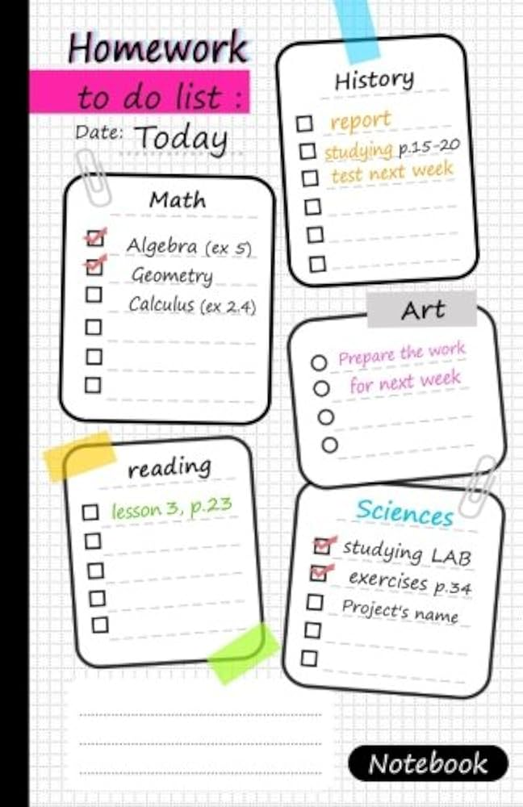

# Assignment-03-Desmond-During

Desmond During 100874002

This ExpressJS application will be a homework tracker which will allow users to create, add, edit, and delete the homework
they post so they can keep track of their work to stay organized. It will provide the user with a list which they have complete
control over.  
  
The application will work similar to the following image. 
The bootstrap used for this project can be found at https://startbootstrap.com/previews/one-page-wonder

w3schools was used for some aid: https://www.w3schools.com/js/js_popup.asp